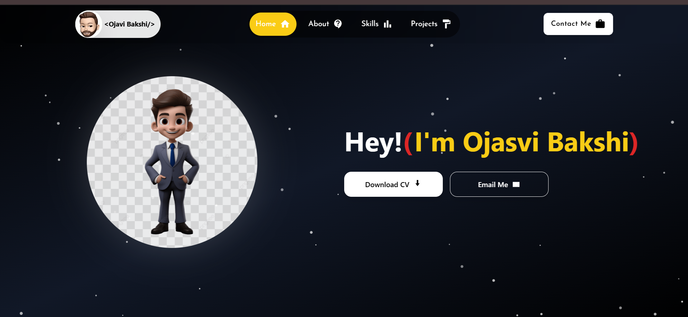

# Portfolio - Ojasvi Bakshi
> Full Stack Developer
# 🚀 Developer Portfolio | Ojasvi Bakshi


A modern, responsive, and animated personal portfolio website built to showcase my journey as a Software Developer, my projects, and my technical skills. Designed with a focus on UI/UX, smooth animations, and clean code.

## 🛠️ Tech Stack

* **Frontend Library:** 
* **Styling:** 
* **Animations:** 
* **Icons:** 
* **Routing:** React Router DOM
* **Navigation:** React Scroll

## ✨ Features

* **🎨 Modern UI:** Sleek, dark-themed design with glassmorphism effects and radial gradients.
* **📱 Fully Responsive:** Optimized for desktops, tablets, and mobile devices with a custom hamburger menu.
* **⚡ Smooth Animations:** detailed entrance animations using Framer Motion (fade-ins, slide-ups).
* **📍 Navigation:** Smooth scrolling between sections (Home, About, Skills, Projects) and page routing.
* **📞 Contact Integration:** Direct links to WhatsApp, Email, and Social Media handles.

## 📸 Screenshots

| Hero Section | About Section |
| :---: | :---: |
|  |  |

## 🚀 Getting Started

Follow these steps to run the project locally on your machine.

### Prerequisites

* Node.js installed (v14 or higher)
* npm or yarn

### Installation

1.  **Clone the repository**
    ```bash
    git clone [https://github.com/your-username/your-repo-name.git](https://github.com/your-username/your-repo-name.git)
    cd your-repo-name
    ```

2.  **Install dependencies**
    ```bash
    npm install
    # or
    npm i 
    ```

3.  **Start the development server**
    ```bash
    npm run dev

    ```

4.  Open [http://localhost:5173](http://localhost:5173) (or localhost:3000) to view it in the browser.

## 📂 Project Structure

```text
src/
├── assets/          # Images, GIFs, and static files
├── components/      # Reusable components (Header, Footer, etc.)
│   ├── AboutSection/
│   ├── Footer/
│   └── Header/
├── pages/           # Main page views
├── App.js           # Main application component
└── main.jsx         # Entry point
```
## 📬 Contact Me
### I am currently open to new opportunities and collaborations!

LinkedIn: [Linkedin](https://www.linkedin.com/in/OjasviBakshi)

GitHub: [Instagram](https://www.instagram.com/ojasvi.bakshi)

Email: ojasvi.bakshi@gmail.com